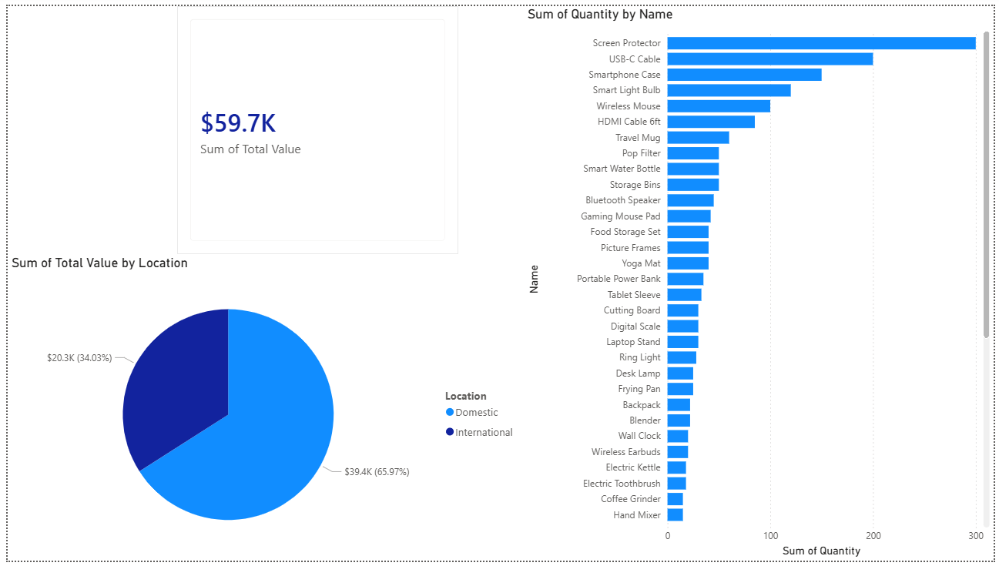

# Inventory & Supplier Analysis Project

## Project Overview
This project analyzes a dataset of 50 inventory items totaling over **$60,000 in asset value**. The goal was to provide a clear view of stock levels, financial exposure, and supplier distribution to assist in procurement decisions.

## Dashboard Preview

## Tools Used
* **SQL (MySQL):** Used for database schema creation, data cleaning, and complex joins to connect products with supplier locations.
* **Power BI:** Used to build an interactive dashboard featuring the "Z-pattern" layout for optimal data readability.

## Key Insights
* **Asset Distribution:** Identified high-value electronics versus high-volume household goods.
* **Supplier Logic:** Segmented inventory by Domestic vs. International suppliers to highlight potential shipping lead times.
* **Financials:** Calculated total inventory value across all categories to identify where the most capital is tied up.

## How to View
* The raw SQL queries can be found in `Inventory_Queries.sql`.
* The interactive report is available in `Inventory_Project.pbix`.
